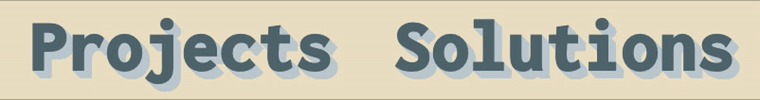

# moregeneric.ca

A place to write about my projects and problem solutions!

## Highlights

I learned a lot in the process of this project. There were a few features I envisioned that I couldn't find a ready-made solution for, so I had to build them from scratch.
Here are a few that I'm proud of.

### "Push Button" Text with Sass Mixins

Extruded text with CSS `text-shadow` is a well-known and well-documented trick. I used Sass mixins to parametrize the extrusion, making it straightforward to achieve this push-button aesthetic for the navigation section of my website.
 

### Tags and Filtering

One of the main reasons behind creating the <i>Solutions</i> portion of my website was tagging problems that I've solved to recognize common patterns between solutions.
Tags are entered into the MDX front matter when writing a Solution post, and then drawn into the static website during the build phase.
Filtering state is managed with React Hooks. Colours are automatically assigned to tags using a simple colour generation procedure.
 

### Masked Images

For the Project cards, I wanted to illustrate monochromatic cover images that match the font colour. Getting the `mask-image` CSS property to play nicely with React's CSS class aliasing was surprisingly tricky. The result is a masked image that stencils a source image onto an arbitrary background, allowing you to get creative with hover effects.
 

